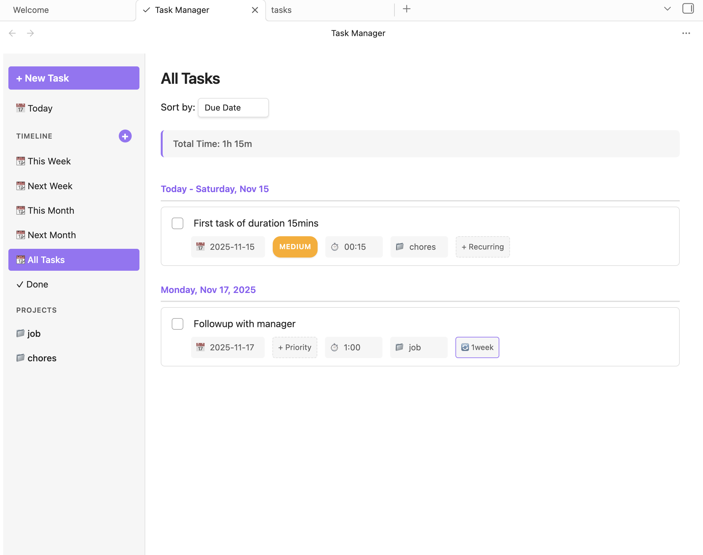
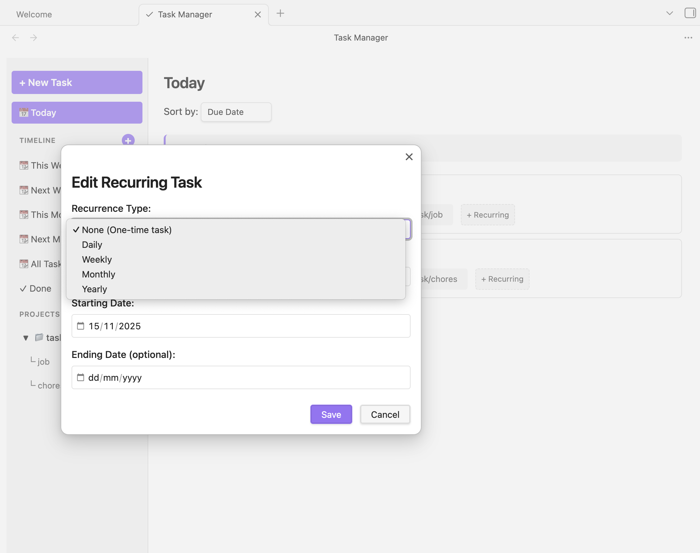
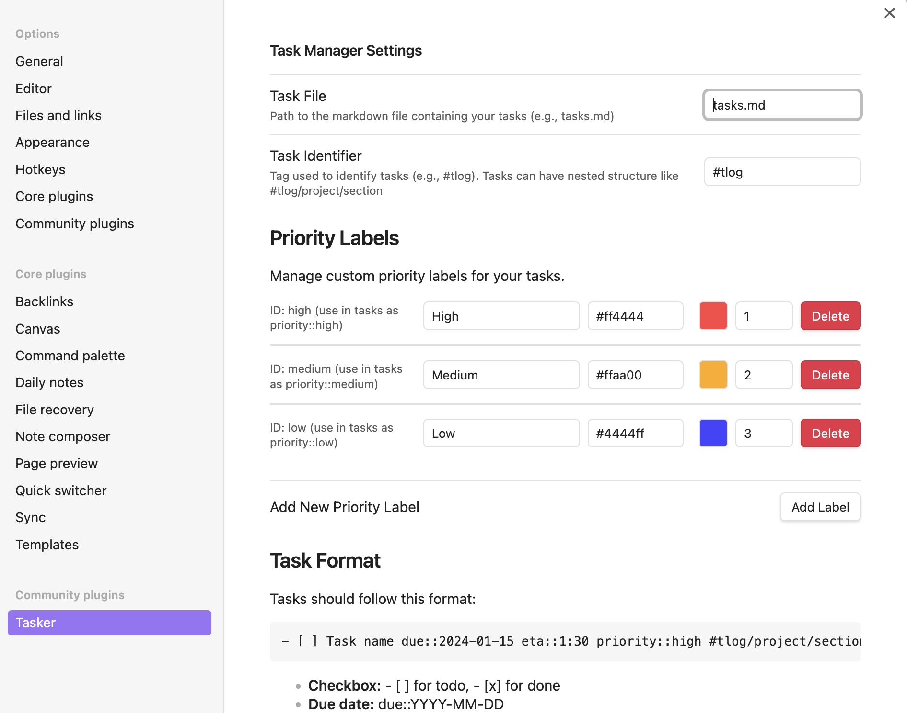
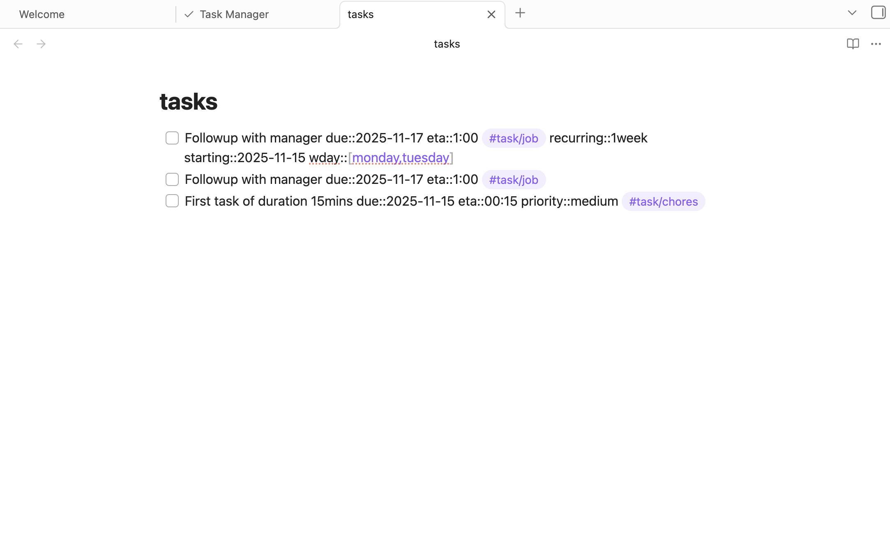

# Tasker

A comprehensive task management plugin for Obsidian with a clean, Todoist-inspired interface.



## Installation

Install from Obsidian's Community Plugins (recommended):
1. Open Settings → Community Plugins
2. Browse and search for "Tasker"
3. Click Install, then Enable

## Features

### All Tasks View
View and manage all your tasks in one place with project organization, priorities, and timeline filters.


### Recurring Tasks
Set up daily, weekly, or monthly recurring tasks with custom patterns and automatic next occurrence generation.



### Settings
Configure task file location, identifier tags, and customize priority labels with colors.



### Task Format
Tasks are stored as markdown with metadata for due dates, time estimates, priorities, and projects.



## Task Format

Tasks use markdown checkboxes with metadata:

```markdown
- [ ] Task name due::2024-01-15 eta::1:30 priority::high #tasker/work/dev
- [ ] Another task due::2024-01-16 eta::0:45 #tasker/personal
- [x] Completed task due::2024-01-14 #tasker/chores
```

### Metadata Fields

- **due::YYYY-MM-DD** - Due date
- **eta::H:MM** - Estimated time
- **priority::label-id** - Priority label
- **#tasker/project/section** - Project organization
- **recurring::Nday|week|month** - Recurring pattern

## Core Features

- **Task Management**: Create, edit, complete, and delete tasks
- **Project Organization**: Nested projects and sections
- **Timeline Views**: Today, Upcoming, This Week, Next Week, This Month, Next Month, All Tasks
- **Priority Labels**: Custom labels with colors
- **Time Tracking**: Estimated time (ETA) with cumulative summaries
- **Recurring Tasks**: Daily, weekly, monthly patterns with custom schedules
- **Internal Links**: Link tasks to notes using `[[Note Name]]` syntax
- **Sorting**: By due date, priority, project, or name
- **Mobile Support**: Fully responsive with touch interactions
- **Inline Editing**: Double-click to edit, click to modify metadata

## Usage

### Opening Tasker

1. Click the checkmark icon in the left ribbon, or
2. Command palette: `Ctrl/Cmd + P` → "Open Task Manager"

### Creating Tasks

- Click "+ New Task" button (desktop) or "+" button (mobile)
- Tasks inherit context from current view (project, due date)

### Editing Tasks

- **Task name**: Double-click to edit
- **Due date**: Click to change
- **ETA**: Click to modify
- **Priority**: Click badge to change
- **Project**: Click tag to update

### Deleting Tasks

- **Desktop**: Hover task → three-dot menu → Delete
- **Mobile**: Long-press task for 1 second → Confirm delete

## Changelog

See [CHANGELOG.md](CHANGELOG.md) for version history.

## Support

- GitHub Issues: [Report bugs or request features](https://github.com/chinmayk/obsidian-task-plugin/issues)
- Forum: [Obsidian Community](https://forum.obsidian.md/)

## Privacy

- No telemetry or tracking
- No external network requests
- All data stays in your vault
- Open source (MIT License)

## License

MIT License - Copyright (c) 2025 Chinmay K

See [LICENSE](LICENSE) for details.

## Author

Created by [Chinmay K](https://github.com/chinmayk)
